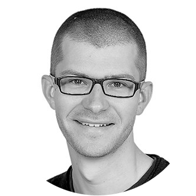

```{css, echo = FALSE}
.pagedjs_page:not(:first-of-type) {
--sidebar-width: 0rem;
--sidebar-background-color: #ffffff;
--main-width: calc(var(--content-width) - var(--sidebar-width));
--decorator-horizontal-margin: 0.2in;
}

.break-after-me {
break-after: page;
}
```


Aside
================================================================================

```{r, echo = FALSE}

```

Contact Info {#contact}
--------------------------------------------------------------------------------

- <i class="fa fa-envelope"></i> mike.smith@embl.de
- <i class="fa fa-github"></i> [github.com/grimbough](https://github.com/grimbough)
- <i class="fa-brands fa-orcid"></i> [0000-0002-7800-3848](https://orcid.org/0000-0002-7800-3848)
- <i class="fa fa-twitter"></i> [@grimbough](https://twitter.com/grimbough)
- For more information, please contact me via email.


Skills {#skills}
--------------------------------------------------------------------------------

Skilled in several programming languages: R, C, Perl, Bash

Worked extensively with out-of-memory representation of large-scale data e.g. HDF5

Experience with cloud deployments (Open Stack, Kubernetes) and container technologies (Docker, Singularity)

Heavily used HPC infrastructure (slurm, lsf, Condor) and parallel processing tools (MPI, OpenMP)


*CV last updated `r format(Sys.time(), "%e %b %Y")`.*

Main
================================================================================

Mike L. Smith {#title}
--------------------------------------------------------------------------------

### Senior Scientific Programmer

I am a research software engineer at the European Molecular Biology Laboratory.

Employed as part of the German Network for Bioinformatics Infrastructure 
(de.NBI), I develop and maintain a variety of tools for the 
analysis of biological data.  In particular, I support many packages
and tools for the Bioconductor project and its community, and am a member of 
both the Bioconductor core team and the community advisory board.

I work closely with experimental scientists and other programmers to create robust,
usable, and performant analysis tools.  I enjoy using software to automate
tasks in order to provide rapid deployment and feedback.

I am also passionate about good software practices for 
reproducible research. I work extensively with version control, containers,
and literate programming tools like R Markdown, champion these practices to
those around me, and have taught multiple courses on these topics.

Professional Experience {data-icon=laptop} 
--------------------------------------------------------------------------------

### Senior Scientific Programmer

European Molecular Biology Laboratory

Heidelberg, DE

2019-

- Developed and deployed Bioconductor Code Tools website for exploring the code behind all Bioconductor packages - [code.bioconductor.org](https://code.bioconductor.org/)
- Designed and maintain Bioconductor GitHub Actions to simplify using GitHub actions for BioC package development - [grimbough/bioc-actions](https://github.com/grimbough/bioc-actions)
- Ported existing HDF5 compression filters to R via the [rhdf5filters](https://bioconductor.org/packages/rhdf5filters) package, and researched the effectiveness of run-length encoding and bit-packing for sparse single-cell data
- Created a continuous integration workflow using GitHub Actions for the Quarto book [Modern Statistics for Modern Biology](https://www.huber.embl.de/msmb/). This rapidly builds chapters in parallel, deploys a new edition of the book if successful, and alerts authors via email if any problems are encountered.
- Organised and hosted monthly Bioconductor Developer Forum and embl-R discussion sessions
- Consulting and/or mentoring junior software developers


### Bioinformatician

European Molecular Biology Laboratory

Heidelberg, DE

2015-19

- Maintained and continued development of several widely used Bioconductor packages with extensive userbases and thousands of downloads per month e.g. [biomaRt](https://bioconductor.org/packages/biomaRt/) and [rhdf5](https://bioconductor.org/packages/rhdf5/). 
  - Modernised code base and updated documentation and vignettes
  - Provided end-user support via email, online forums, and GitHub issues
- In collaboration with experimental biologists, developed software for the analysis of pool CRISPR-based screens
- Developed workflows for analysis of bulk RNA-seq data
- Created [BiocWorkflowTools](https://bioconductor.org/packages/BiocWorkflowTools/) for publishing R Markdown documents as both Bioconductor Workflows and publications


### Research Associate

Cancer Research UK Cambridge Institute

Cambridge, UK

2013-15

- Wrote and deployed workflows for analysing structural variation data as part of the Oesophageal ICGC project
- Developed quality control software for Oxford Nanopore sequencing data
- Researched the impact data quality had on downstream analysis and results

Education {data-icon=graduation-cap data-concise=true}
--------------------------------------------------------------------------------

### University of Cambridge

PhD, Computational Biology,<br> Department of Oncology

Cambridge, UK

2009-12

**Thesis:** Low-level artefacts affecting microarrays and next-generation sequencing in a cancer genomics environment

::: concise
- Detecting alternative splicing with gene expression microarrays
- Analysis of DNA and RNA sequencing data
- Developed tools for data quality control, assessment and correction
- Studied data compression and access patterns
:::

### Cardiff University

M.S. (with Distinction) in Bioinformatics

Cardiff, UK

2007-08

**Dissertation:** The development of parallel processing techniques for the analysis of genome wide association studies

### University of Bath

BSc (2.2) in Mathematics with Computing

Bath, UK

2003-07

**Dissertation:** A distributed computing approach to finding missing genes using protein threading


Teaching Experience {data-icon=chalkboard-teacher}
--------------------------------------------------------------------------------

### Advanced topics in single-cell transcriptomics

Working with on-disc data formats

Swiss Institute for Bioinformatics, Online

2020

[Youtube Recording](https://www.youtube.com/watch?v=lpPHwLcdk8I)

### BBSRC Advanced Methods for Reproducible Science Workshop

Introduction to R Markdown and literate programming for reproducible research

Windsor, UK

2018-20

### EMBL Software Carpentry

Introduction to HPC with Slurm

Heidelberg, DE

2016-18 2020

### Statistical Data Analysis for Genome-Scale Biology (CSAMA)

A one week intensive course teaching analysis of multi-omics studies.  Variously I have taught,
provided online and in-person technical support, administered the course website and teaching 
materials, and reviewed applications from students

Brixen, IT

2015-19 2022


\newpage


Software Development Community {data-icon=calendar-days}
-------------------------------------------------------------------------------

### Bioconductor New Developer Program

Co-organiser and reviewer of applications from prospective mentors and
mentees. 

N/A

2021-


### embl-R coding club

Co-organiser and host of EMBL's internal R programming group, holding tutorials,
package demos, talks and discussions.

N/A

2020-21


### Bioconductor Developers' Forum

Organiser and host of the monthly developers' forum, a series of presentations 
and workshops intended to bring the developer community closer together<br>[Youtube Playlist](https://www.youtube.com/playlist?list=PLdl4u5ZRDMQQLMupAtEzm2y4gUIUm_1n6)

N/A

2019-21


Prizes, Awards, and Grants {data-icon=award}
--------------------------------------------

### CZI Funding Call - Single-cell biology

Statistical Analysis and Comprehension of the Human Cell Atlas in R / Bioconductor: Access and Scalable Infrastructure - $45,000

N/A

2018

Applied in collaboration with Wolfgang Huber

### RStudio Bookdown Contest

Runner-up.  Awarded for msmbstyle, a tufte inspired markdown theme.

N/A

2018

### UseR 2011 - Poster Prize

N/A

N/A

2011

### BioC Conference 2011 Travel and Accommodation Scholarship

N/A 

N/A

2011

### Cancer Research UK - Tuition and Maintenance Scholarship 

N/A 

N/A

2007

\pagebreak

## Publications {data-icon=book}

<div class="references">

```{r, echo = FALSE, results='asis', warning=FALSE}
bib <- bib2df::bib2df("references/works.bib") |> 
  dplyr::arrange(desc(YEAR))
me_first <- vapply(bib$AUTHOR, function(x) { grepl(pattern = "Smith", x[1]) }, 
                   FUN.VALUE = logical(1)) 
print_cite <- function(x) { sprintf("- %s. *%s*. %s (%s)", 
                                    paste(unlist(x$AUTHOR), collapse = ", "), 
                                    x$TITLE,
                                    x$JOURNAL,
                                    x$YEAR) }

cat("<h3>First Author</h3>\n")

cat(apply(bib |> dplyr::filter(me_first), 1, print_cite), sep = "\n")

cat("\n<h3>Contributing Author</h3>\n")
cat(apply(bib |> dplyr::filter(!me_first), 1, print_cite), sep = "\n")

```


</div>
