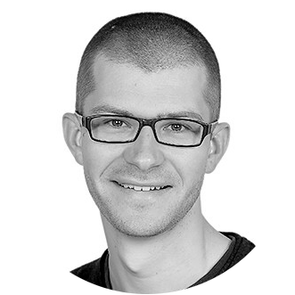

```{css, echo = FALSE}
.pagedjs_page:not(:first-of-type) {
--sidebar-width: 0rem;
--sidebar-background-color: #ffffff;
--main-width: calc(var(--content-width) - var(--sidebar-width));
--decorator-horizontal-margin: 0.2in;
}

```


Aside
================================================================================

```{r, echo = FALSE}

```

Contact Info {#contact}
--------------------------------------------------------------------------------

- <i class="fa fa-envelope"></i> mike.smith@embl.de
- <i class="fa fa-github"></i> [github.com/grimbough](https://github.com/grimbough)
- <i class="fa-brands fa-orcid"></i> [0000-0002-7800-3848](https://orcid.org/0000-0002-7800-3848)
- <i class="fa fa-twitter"></i> [@grimbough](https://twitter.com/grimbough)
-  [BioC Support Site](https://support.bioconductor.org/u/3986/)
- For more information, please contact me via email.


Skills {#skills}
--------------------------------------------------------------------------------

Focused on implementing FAIR principles for data management

Experience with cloud technologies (Kubernetes, OpenStack, S3) and containers (Docker, Singularity)

Heavily used workflow managers, HPC infrastructure and parallel processing tools

Skilled in several programming languages: R, C, Python, Perl, Bash

Worked extensively with on-disk representations of large-scale data e.g. HDF5, Zarr

*CV last updated `r format(Sys.time(), "%e %b %Y")`.*

Main
================================================================================

Mike L. Smith {#title}
--------------------------------------------------------------------------------

### Data Management Coordinator - European Molecular Biology Laboratory.

My current role involves supporting the needs of EMBL's large-scale data generation and collection 
activities, identifying and addressing technical issues to improve data handling practice.

As part of the EMBL Data Science Centre, I work closely with researchers, 
scientific core facilities, IT services, and other data management experts to 
harmonise efforts in large-scale biological data management across EMBL’s 
international sites.  My team and I develop and deploy tools, workflows and 
best practice protocols to streamline data processes and maximise the utility of 
EMBL’s research data.

I am also passionate about research software engineering and good software practices for 
reproducible research. I work extensively with version control, containers,
and literate programming tools like R Markdown, champion these practices to
those around me, and have taught multiple courses on these topics.

Professional Experience {data-icon=laptop} 
--------------------------------------------------------------------------------

### Data Management Coordinator

European Molecular Biology Laboratory

Heidelberg, DE

2023-

- Leading a small, internationally distributed, team focused on improving
data management across the laboratory, from production to deposition
in public repositories.
- Coordinating the implementation of standardised, high-throughput, data processing 
pipelines using containerized software and workflow languages, such as Nextflow and Snakemake, 
in HPC and cloud computing environments.
- Establishing best practices for metadata standards and documentation to enhance data usability,
in particular by following the FAIR (Findable, Accessible, Interoperable, and Reusable) data principles.
- Experience with the data management requirements for a range of
biological data modalities, including sequencing, microscopy imaging, and
x-ray crystallography.
- Recruiting, setting objectives, appraising, and mentoring direct reports in the 
data management team.
- Providing consultation services to scientists and project managers to construct and implement 
data management plans, meeting the requirements of both grant funding agencies
and researchers working at the bench.
- Overseeing how research data is stored, structured, and archived for accessibility and long-term preservation.
- Delivering training and workshops on data management best practices
- Ensuring compliance with institutional and funding agency data policies
- Coordinating with staff at regional partners in the Health + Life Science Alliance
Heidelberg Mannheim to develop a platform proposal for data sharing and collaboration
between institutions

### Senior Scientific Programmer

European Molecular Biology Laboratory

Heidelberg, DE

2019-23

- Identified the need for Zarr support in R and created [Rarr]([grimbough/bioc-actions](https://github.com/grimbough/Rarr)), the first R/Zarr interface.
- Developed and deployed [Bioconductor Code Tools](https://code.bioconductor.org/) website.  Using Docker containers and a Kubernetes deployment, this site provides tools for browsing and searching the code behind all Bioconductor packages.
- Designed and maintained Bioconductor GitHub Actions to simplify using GitHub actions for BioC package development - [grimbough/bioc-actions](https://github.com/grimbough/bioc-actions)
- Ported HDF5 compression filters to R via [rhdf5filters](https://bioconductor.org/packages/rhdf5filters) & benchmarked their performance on single-cell data.
- Created a continuous integration workflow using GitHub Actions for the Quarto book [Modern Statistics for Modern Biology](https://www.huber.embl.de/msmb/). This rapidly builds chapters in parallel, deploys a new edition of the book if successful, and alerts authors via email if any problems are encountered.
- Organised and hosted monthly Bioconductor Developer Forum and embl-R discussion sessions
- Mentored junior software developers, both within EMBL and the wider community, to improve their R skills and develop their own packages.


### Bioinformatician

European Molecular Biology Laboratory

Heidelberg, DE

2015-19

- Maintained and continued development of several widely used Bioconductor packages with extensive userbases and thousands of downloads per month e.g. [biomaRt](https://bioconductor.org/packages/biomaRt/) and [rhdf5](https://bioconductor.org/packages/rhdf5/). This involved:
  - Modernising and strengthening the code base via code review & development of unit tests
  - Updating documentation and vignettes
  - Providing end-user support via email, online forums, and GitHub issues
- Collaborated with experimental biologists to develop software for the analysis of pooled CRISPR screens
- Developed workflows for analysis of bulk RNA-seq data, deployed on an HPC cluster
<!-- - Created [BiocWorkflowTools](https://bioconductor.org/packages/BiocWorkflowTools/) for publishing R Markdown documents as both Bioconductor Workflows and publications -->


### Research Associate

Cancer Research UK Cambridge Institute

Cambridge, UK

2013-15

- Wrote and deployed workflows for analysing structural variation data as part of the Oesophageal ICGC project
- Developed quality control software for Oxford Nanopore sequencing data
- Researched the impact data quality had on downstream analysis and results

<!-- Software Development Community Engagment {data-icon=calendar-days} -->
<!-- ------------------------------------------------------------------------------- -->

<!-- ### Bioconductor Community Advisory Board -->

<!-- Elected to a three year term on the Community Advisory Board, where the aim is  -->
<!-- to engage the user and developer communities with training, outreach and a  -->
<!-- welcoming environment. As part of this I have been involved in creating and running  -->
<!-- a New Developer mentorship scheme, as well as the Package Review and Privacy working groups. -->

<!-- N/A -->

<!-- 2021-24 -->

<!-- - **New Developer Program** - This program aims to encourage new developers to -->
<!-- make the jump from scripting into package development by pairing them with more  -->
<!-- experienced mentors.  As co-lead I have been responsible for designing the program, -->
<!-- soliciting and reviewing applications from mentors and mentees, creating mentorship -->
<!-- pairings, and checking on progress and satisfaction with the scheme. -->
<!-- - **Package Review Working Group** - Created to review and revise the process via  -->
<!-- which packages are accepted into Bioconductor, we have systematically updated the -->
<!-- guidelines for packages authors and submission.  We have also successfully recruited -->
<!-- a new cohort of reviewers to speed up the review process. -->
<!-- - **Privacy Working Group** - With its large community of users and many websites and  -->
<!-- services hosted by a variety of organisations around the globe, data privacy is -->
<!-- a serious issue for Bioconductor.  We are engaged in making sure that Bioconductor  -->
<!-- services meet both legal requirements and community expectations regarding  -->
<!-- personal data privacy. -->


<!-- ### embl-R Coding Club -->

<!-- Co-organiser and host of EMBL's longest running programming group. We hold bi-weekly tutorials, -->
<!-- package demos, talks and discussions on anything R related.  I have personally taught sessions -->
<!-- on package development, data wrangling, parallel processing among others, as  -->
<!-- well as arranging the program of speakers. -->

<!-- N/A -->

<!-- 2020- -->


<!-- ### Bioconductor Developers' Forum -->

<!-- Organiser and host of the monthly developers' forum, a series of presentations  -->
<!-- and workshops intended to bring the developer community closer together.  This  -->
<!-- has included presentations by members of R Core, RStudio, rOpenSci and Microsoft.<br> -->
<!-- [Youtube Playlist](https://www.youtube.com/playlist?list=PLdl4u5ZRDMQQLMupAtEzm2y4gUIUm_1n6) -->

<!-- N/A -->

<!-- 2019-21 -->

Education {data-icon=graduation-cap data-concise=true}
--------------------------------------------------------------------------------

### University of Cambridge

PhD, Computational Biology,<br> Department of Oncology

Cambridge, UK

2009-12

**Thesis:** Low-level artefacts affecting microarrays and next-generation sequencing in a cancer genomics environment

<!--
- Detecting alternative splicing with gene expression microarrays
- Analysis of DNA and RNA sequencing data
- Developed tools for data quality control, assessment and correction
- Studied data compression and access patterns
-->

### Cardiff University

MSc (with Distinction) in Bioinformatics

Cardiff, UK

2007-08

**Dissertation:** The development of parallel processing techniques for the analysis of genome wide association studies

### University of Bath

BSc (2.2) in Mathematics with Computing

Bath, UK

2003-07

**Dissertation:** A distributed computing approach to finding missing genes using protein threading


<!-- Teaching Experience {data-icon=chalkboard-teacher} -->
<!-- -------------------------------------------------------------------------------- -->

<!-- ### EMBL Internal Data Management Training -->

<!-- Multiple internal courses given to fellows and staff on data management best practices and tools -->

<!-- Heidelberg, DE -->

<!-- 2023-25 -->

<!-- ### OLISSIPO Workshop - Introduction to R -->

<!-- One day course introducing R for data analysis -->

<!-- Lisbon, PT -->

<!-- 2023 -->

<!-- ### Advanced topics in single-cell transcriptomics -->

<!-- Working with on-disc data formats -->

<!-- Swiss Institute for Bioinformatics, Online -->

<!-- 2020 -->

<!-- [Youtube Recording](https://www.youtube.com/watch?v=lpPHwLcdk8I) -->

<!-- ### BBSRC Advanced Methods for Reproducible Science Workshop -->

<!-- Introduction to R Markdown and literate programming for reproducible research -->

<!-- Windsor, UK -->

<!-- 2018 2019 2020 -->

<!-- ### EMBL Software Carpentry -->

<!-- Introduction to HPC with Slurm -->

<!-- Heidelberg, DE -->

<!-- 2016-18 2020 -->

<!-- ### Statistical Data Analysis for Genome-Scale Biology (CSAMA) -->

<!-- A one week intensive course teaching analysis of multi-omics studies.  Variously I have taught, -->
<!-- provided online and in-person technical support, administered the course website and teaching  -->
<!-- materials, and reviewed applications from students -->

<!-- Brixen, IT -->

<!-- 2015-19 2022 -->

<!--
Prizes, Awards, and Grants {data-icon=award}
--------------------------------------------

### CZI Funding Call - Single-cell biology

Statistical Analysis and Comprehension of the Human Cell Atlas in R / Bioconductor: Access and Scalable Infrastructure - $45,000

N/A

2018

Applied in collaboration with Wolfgang Huber

### RStudio Bookdown Contest

Runner-up.  Awarded for msmbstyle, a tufte inspired markdown theme.

N/A

2018

### UseR 2011 - Best Technical Poster Prize

N/A

N/A

2011

### BioC Conference 2011 Travel and Accommodation Scholarship

N/A 

N/A

2011
--> 

\pagebreak

## Publications {data-icon=book}

<div class="references">

```{r, echo = FALSE, results='asis', warning=FALSE}
bib <- bib2df::bib2df("references/works.bib") |> 
  dplyr::arrange(desc(YEAR))
me_first <- vapply(bib$AUTHOR, function(x) { grepl(pattern = "Smith", x[1]) }, 
                   FUN.VALUE = logical(1)) 
print_cite <- function(x) { sprintf("- %s. *%s*. %s (%s)", 
                                    paste(unlist(x$AUTHOR), collapse = ", "), 
                                    x$TITLE,
                                    x$JOURNAL,
                                    x$YEAR) }

cat("<h3>First Author</h3>\n")

cat(apply(bib |> dplyr::filter(me_first), 1, print_cite), sep = "\n")

cat("\n<h3>Contributing Author</h3>\n")
cat(apply(bib |> dplyr::filter(!me_first), 1, print_cite), sep = "\n")

```


</div>
